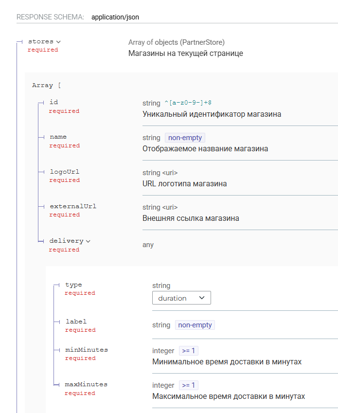

### Текст задания

**Описание:** Интернет-магазин "Петрушка Зеленая" преуспевает, расширяется и в мобильном приложении решили создать новый экран, который будет отображать магазины партнеров (см. макеты ниже). 

**Что нужно сделать:** 1. Написать пример REST API запроса, который будет вызываться при переходе пользователя на данный экран. 2. Привести пример ответа этого REST API в соответствии с макетом. Формат - JSON. Учесть, что при клике на плашку магазина должен осуществляться переход по ссылке на внешний ресурс.

### Результат

!NB на данном этапе запрос сформулирован исходя из предположений о бизнес-логике, а документация приведена для дальнейшего выявления требований, она не претендует на прод версию

Подготовлена документация в формате openapi (бывш swagger), доступна по ссылке: https://ivansolomahin.github.io/SA_test_task_stackbridge/#tag/Partners

Внутри: 
- пагинация
- возможность поиска



пример запроса:  
```
GET /partners/stores?city=spb&deliveryType=duration&availableOnly=true&limit=2 HTTP/1.1
Host: api.petrushka.ru
Accept: application/json
```

пример ответа:
``` json
{
  "stores": [
    {
      "id": "vkusvill",
      "name": "ВкусВилл",
      "logoUrl": "https://cdn.petrushka.ru/partners/logos/vkusvill.png",
      "externalUrl": "https://vkusvill.ru/",
      "delivery": {
        "type": "duration",
        "label": "Быстрая доставка",
        "minMinutes": 20,
        "maxMinutes": 60
      }
    },
    {
      "id": "samokat",
      "name": "Самокат",
      "logoUrl": "https://cdn.petrushka.ru/partners/logos/samokat.png",
      "externalUrl": "https://samokat.ru/",
      "delivery": {
        "type": "duration",
        "label": "Доставка от",
        "minMinutes": 15,
        "maxMinutes": 45
      }
    }
  ],
  "count": 2,
  "total": 125,
  "pageInfo": {
    "hasNextPage": true,
    "nextCursor": "eyJpZCI6InNhbW9rYXQifQ=="
  }
}
```

