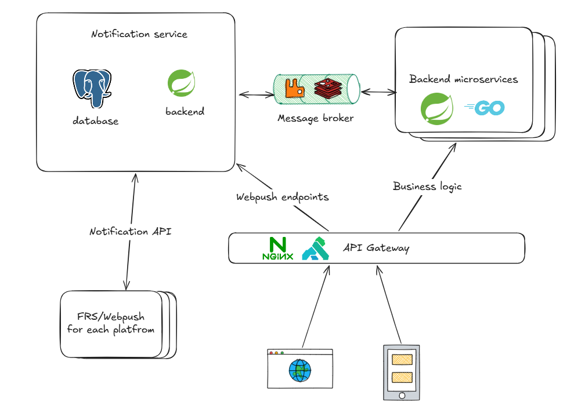

## Текст задания

**Описание:** Заказчик хочет, что в мобильное приложение интернет-магазина "Петрушка Зеленая" начали приходить пуши. Они могут быть разными: о том, что заказ слишком долго лежит без действий в корзине, об отмене заказа, рекламные рассылки и прочее. То есть нужен функционал, а какие пуши отправлять - точно найдется.
**Что нужно сделать:** Построить верхнеуровневую архитектурую схему - как должна работать отправка PUSH уведомлений в данном приложении. Можно просто в виде блок схем. Считаем, что на бэкенде микросервисная архитектура. В данном задании рекомендуется в интернете изучить архитектуры подобных решений. Быть готовым на собеседовании обсудить эту схему

## Решение

На рисунке представлено схематичное описание архитектуры.

Все взаимодействие должно происходить через отдельный микросервис уведомлений. 
Внутри него должна быть БД, хранящая информацию об эндпоинтах для отправки уведомлений и бизнес-логика.

Примерное описание таблиц: 
- **users** — сопоставление внутреннего id с id из внешней системы (микросервисов через брокер).
- **platforms** — справочник платформ (web, ios, android) для мультиплатформенного webpush.
- **push_subscriptions** — endpoint'ы FRS/Webpush для каждой платформы, привязанные к пользователю (соответствует блоку "FRS/Webpush for each platform" на схеме).
- **notification_templates** — шаблоны уведомлений (заголовок, текст, приоритет), чтобы не хардкодить контент.
- **notifications** — сами уведомления с payload из бизнес-логики (от backend microservices через message broker).
- **notification_deliveries** — статус доставки по каждому каналу и подписке (delivered/failed/expired) — важно для retry-логики.

Взаимодействие с микросервисами стоит настроить через брокеры сообщений для надежности и обработки пиковых нагрузок.

Масштабирование возможно через репликацию микросервиса по географическому признаку / user_id.

